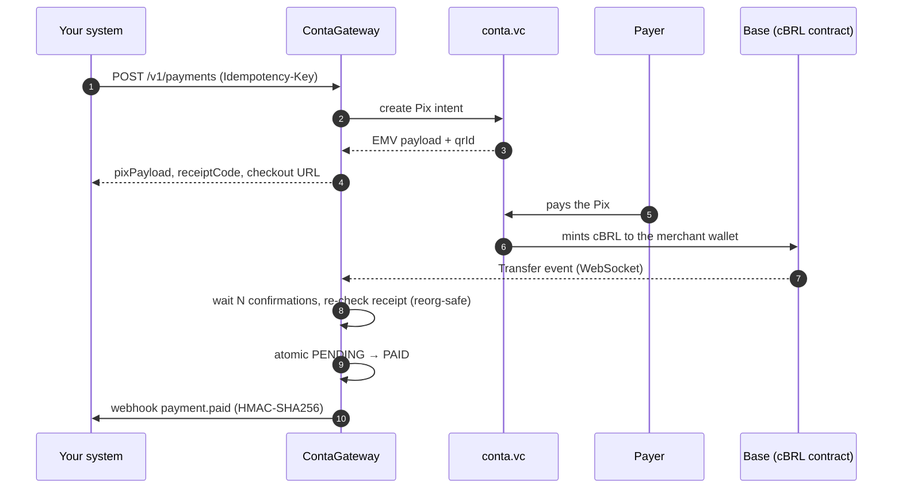

# ContaGateway

🇺🇸 **English** · 🇧🇷 [Português](./README.pt-BR.md)

[](https://github.com/rafaelw3/ContaGateway/actions/workflows/ci.yml)


**A payment gateway that turns Brazilian Pix payments into on-chain settlement.**
It issues a Pix charge through [conta.vc](https://conta.vc), watches the **Base** blockchain
for the matching **cBRL** stablecoin mint, and notifies your system through a signed webhook —
no manual reconciliation, no custody of funds.

<p align="center">
  
  <br>
  <sub><em>The <code>/pay/:id</code> checkout page, rendered from the real template with fictitious data.</em></sub>
</p>

---

<details>
<summary><strong>Contents</strong></summary>

- [How it works](#how-it-works)
- [Engineering highlights](#engineering-highlights)
- [Quick start](#quick-start)
- [API](#api)
- [Configuration](#configuration)
- [Testing](#testing)
- [Operations](#operations)
- [Project docs](#project-docs)
- [License](#license)

</details>

---

## How it works



**The cBRL mint to the expected wallet is the single source of truth for settlement.**
conta.vc also moves a reserve token (BRLA) on every payment, but that transfer always goes to
a fixed reserve wallet — even when the cBRL went somewhere else — so it is monitored only as a
diagnostic signal and never changes a payment's status. Getting this wrong was the original bug
this design fixes; the reasoning is in [`DECISIONS.md`](./DECISIONS.md).

## Engineering highlights

| Problem | How it is handled |
| --- | --- |
| **Chain reorgs** | Waits `WEB3_REQUIRED_CONFIRMATIONS` blocks, then re-fetches the receipt and checks the tx is still in its original block before settling. |
| **Downtime / dropped WebSocket events** | A per-contract checkpoint (`sync_checkpoints`) records the last fully processed block. On boot, reconnect and every minute the listener backfills from it in chunks, so a Pix paid while the service was down — for minutes or days — still settles. The checkpoint only advances when the whole chunk succeeded. |
| **Two pending charges with the same amount** | Queries the provider for each candidate's status, prefers the confirmed one, falls back to FIFO; the DB transition is a conditional `updateMany` (`PENDING → PAID`), never `SELECT` + `UPDATE`. |
| **Pix paid seconds before expiry** | A grace window compares against the **mint's block time**, not processing time — "did the money arrive in time?". A mint never settles a charge created after it. |
| **Funds sent to the wrong wallet** | Listens to all cBRL mints; a matching amount to a different wallet marks the charge `MISROUTED` for audit instead of `PAID`. |
| **Duplicate client requests** | `Idempotency-Key` + unique column + `P2002` recovery; reusing a key with a **different amount** is rejected (`422`) instead of silently returning the wrong charge. |
| **Webhook SSRF** | `https` only, private/link-local/metadata ranges blocked, re-validated against DNS rebinding right before dispatch, `maxRedirects: 0`. |
| **Undocumented upstream API** | conta.vc's intent endpoint is internal and unsupported, so responses pass a contract-drift guard and the returned Pix is parsed as a BR Code (CRC16, `br.gov.bcb.pix`, amount field) before it ever reaches a payer. A GET-only probe (`npm run probe:contavc`) detects upstream changes without creating charges. |
| **Leaking internals** | API responses are an explicit allowlist (`serializePaymentResponse`) backed by Fastify response schemas; `webhookUrl` (often carries a token) never leaves the server. Secrets in RPC URLs are redacted at the source. |
| **Money rounding** | Cents are canonical end to end. More than 2 decimal places is a `400`, never a silent round. |

Architecture is strictly layered — thin Fastify controllers → services (business logic + Prisma) →
`lib/` utilities — and `app.ts` (assembly) is separate from `server.ts` (boot) so every route is
tested with `.inject()` without opening ports or a real WebSocket. Details in
[`ARCHITECTURE.md`](./ARCHITECTURE.md).

## Quick start

**Prerequisites:** Node.js 22 LTS, Docker with Compose, and a conta.vc account with a public payment
link (`https://app.conta.vc/pay/<handle>`) and a Base wallet registered under *Settings → Security*.

```bash
npm ci
npm run setup               # interactive wizard: asks handle + wallet, generates secrets, writes .env
docker compose up -d --build
```

API on `http://localhost:3000`, interactive OpenAPI docs on `http://localhost:3000/documentation`.

For hot-reload development:

```bash
docker compose up -d postgres
npm run prisma:generate
npx prisma migrate deploy
npm run dev
```

> [!WARNING]
> Charge creation relies on conta.vc's checkout endpoint (`/api/pay/intent`), which has no public
> contract or SLA for third parties. The gateway is defensive about it (see highlights), but treat it
> as an external dependency that may change.

## API

Full OpenAPI 3 spec at `/documentation/json`, generated from the same JSON Schemas used for validation.

| Endpoint | Auth | Description |
| :--- | :--- | :--- |
| `POST /v1/payments` | `X-API-Key` | Create a Pix charge. Supports `Idempotency-Key`. |
| `GET /v1/payments/:id` | `X-API-Key` | Full payment details (on-chain hash, metadata, status). |
| `GET /v1/payments/:id/status` | public | Lightweight status for frontend polling. |
| `GET /pay/:id` | public | Checkout page: QR code, Pix copy-and-paste, countdown. |
| `GET /v1/payments/:id/qrcode` | public | QR code PNG (HTTP-cached). |
| `POST /v1/payments/:id/webhook/retry` | `X-API-Key` | Re-queue a failed webhook. |
| `GET /health` | public | Liveness. |
| `GET /health/ready` | public | Readiness: Postgres and Base RPC both healthy, else `503`. |

```bash
curl -X POST http://localhost:3000/v1/payments \
  -H "Content-Type: application/json" \
  -H "X-API-Key: <your-api-key>" \
  -H "Idempotency-Key: e8a088cf-9a91-4d1a-9694-a9526715f012" \
  -d '{ "amountCents": 5000, "webhookUrl": "https://your-system.example/webhooks/pix", "metadata": { "orderId": "ORD-102030" } }'
```

Payment states: `PENDING`, `PAID`, `EXPIRED`, `MISROUTED`.

### Verifying the webhook signature

Every delivery carries `X-Signature` (HMAC-SHA256 of the raw body with `WEBHOOK_SECRET`) and `X-Timestamp`:

```javascript
import crypto from 'node:crypto';

export function verifyWebhook(rawBody, signatureHeader, secret) {
  if (!signatureHeader) return false;
  const expected = crypto.createHmac('sha256', secret).update(rawBody).digest('hex');
  const a = Buffer.from(signatureHeader, 'utf-8');
  const b = Buffer.from(expected, 'utf-8');
  return a.length === b.length && crypto.timingSafeEqual(a, b);
}
```

## Configuration

Main variables (full, commented list in [`.env.example`](./.env.example)):

| Variable | Default | Description |
| :--- | :--- | :--- |
| `CONTA_VC_USERNAME` | — | conta.vc handle. Required; boot fails in production without it. |
| `RECIPIENT_WALLET_ADDRESS` | — | Base wallet that receives cBRL. |
| `BASE_WSS_RPC_URL` | `wss://base-rpc.publicnode.com` | Base WebSocket RPC. |
| `WEB3_REQUIRED_CONFIRMATIONS` | `3` | Blocks to wait before settling. |
| `SETTLEMENT_GRACE_PERIOD_MS` | `1800000` | Post-expiry window (30 min) for late blocks. |
| `API_KEY` | — | One or more comma-separated keys (zero-downtime rotation). |
| `WEBHOOK_SECRET` | — | HMAC secret for outgoing webhooks. |
| `REDIS_URL` | — | Optional: shared rate-limit store for multi-instance deploys. |
| `SENTRY_DSN` / `OPS_ALERT_WEBHOOK_URL` | — | Optional alerting; everything works without them. |

## Testing

```bash
npm run db:up && npm run test:migrate   # once: Postgres for tests
npm run typecheck
npm test                                # 230 tests (Vitest)
```

Tests cover concurrency, idempotency, grace windows, reorg handling, checkpoint sync and the
conta.vc contract — using `.env.test`, fake RPCs and a fake conta.vc on `127.0.0.1`, so they never
touch real services. CI runs the same steps plus `npm audit` on every push.

## Operations

| Command | What it does |
| --- | --- |
| `npm run reconcile` | Read-only on-chain audit: cBRL mints with no settled charge, and `PAID` rows with no on-chain proof. |
| `npm run webhook:resend -- --list` | Lists `PAID` payments whose webhook failed; `-- <id>` resends with confirmation. |
| `npm run probe:contavc` | GET-only check for changes in the upstream conta.vc endpoint. |
| `scripts/backup-postgres.sh` / `restore-postgres.sh` | `pg_dump` + `rclone` to any S3-compatible storage; restore refuses to overwrite a non-empty DB. |

Runs anywhere Docker runs (local, VPS, PaaS). The image is multi-stage Alpine and runs as non-root.

## Project docs

- [`ARCHITECTURE.md`](./ARCHITECTURE.md) — layers, data model, invariants (Portuguese).
- [`DECISIONS.md`](./DECISIONS.md) — engineering decision log with the *why* behind each one (Portuguese).
- [`CONTRIBUTING.md`](./CONTRIBUTING.md) · [`SECURITY.md`](./SECURITY.md)

## License

[MIT](./LICENSE)
