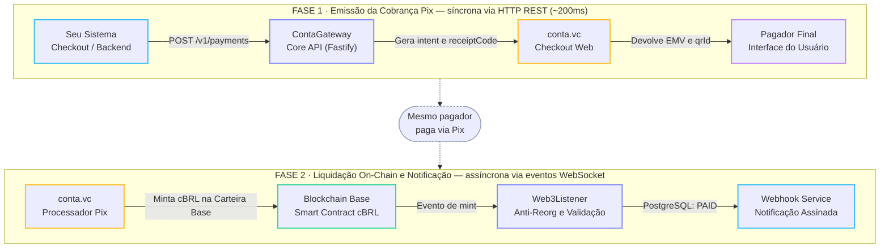
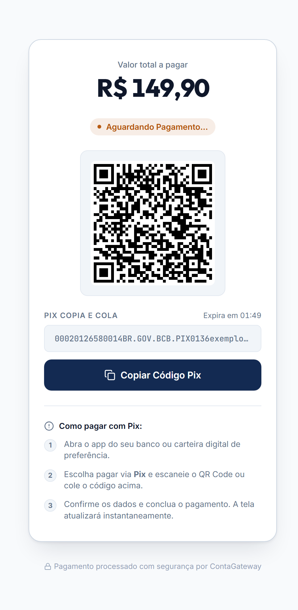

# ContaGateway

🇺🇸 [English](./README.md) · 🇧🇷 **Português**

[](https://github.com/rafaelw3/ContaGateway/actions/workflows/ci.yml)


API REST de gateway de pagamentos que conecta cobranças Pix à liquidação on-chain na rede Base. O sistema emite cobranças Pix via checkout da conta.vc, monitora emissões (mints) de **cBRL** diretamente na blockchain via WebSocket RPC, reconcilia transações concorrentes com validação híbrida e notifica sistemas integradores via webhooks assinados.

---

<details>
<summary><strong>Índice</strong></summary>

- [Visão Geral](#visão-geral)
- [Modelo de Liquidação On-Chain](#modelo-de-liquidação-on-chain)
- [Integração com a conta.vc](#integração-com-a-contavc)
- [Início Rápido](#início-rápido)
- [Referência da API](#referência-da-api)
- [Parâmetros de Configuração](#parâmetros-de-configuração)
- [Segurança e Resiliência](#segurança-e-resiliência)
- [Backup e Restauração](#backup-e-restauração)
- [Testes](#testes)
- [Contribuindo](#contribuindo)
- [Documentação Adicional](#documentação-adicional)
- [Licença](#licença)

</details>

---

## Visão Geral

O ContaGateway funciona como camada de automação entre o Pix bancário e a liquidação em stablecoin:

1. **Emissão da Cobrança**: Gera cobranças Pix via checkout público da conta.vc a partir do handle do integrador, devolvendo o payload Pix Copia e Cola (EMV), identificador (`qrId`), código de recibo público (`receiptCode`) e página de checkout web.
2. **Monitoramento On-Chain**: O listener de eventos (`Web3Listener`) mantém conexão WebSocket persistente com a rede Base, capturando mints de cBRL em tempo real.
3. **Proteção Anti-Reorg**: Aguarda confirmações de bloco configuráveis e revalida a imutabilidade do bloco antes de efetivar qualquer liquidação.
4. **Validação Híbrida**: Cruza o evento on-chain com o status do provedor para resolver eventuais colisões de cobranças com mesmo valor, aplicando transições atômicas no PostgreSQL.
5. **Notificação Assinada**: Concluída a liquidação, dispara webhooks assinados com HMAC-SHA256 (`payment.paid`) com retentativas automáticas e backoff exponencial.



---

## Modelo de Liquidação On-Chain

### cBRL como Fonte de Verdade Exclusiva

Nas transações processadas pela conta.vc ocorrem dois fluxos on-chain distintos na rede Base:

- **cBRL**: Token próprio da conta.vc ("contaBRL"). É emitido (mintado) diretamente para a carteira cadastrada pelo usuário na conta.vc, representando a entrega real e líquida dos fundos.
- **BRLA**: Token de entidade terceira (Avenia / Ada Capital) utilizado como reserva de lastro institucional. O movimento de BRLA vai sempre para uma carteira de reserva fixa da conta.vc, independentemente de o mint de cBRL ter ido para a carteira correta ou não.

Por essa razão, **apenas o mint de cBRL na carteira esperada decide a liquidação**. O token BRLA é monitorado apenas como sinal de diagnóstico opcional e nunca altera o status de um pagamento.

### Desvios de Rota e Status `MISROUTED`

O listener escuta os eventos de cBRL na rede Base sem filtrar previamente por carteira de destino na subscrição, garantindo visibilidade total contra desvios:

- **Atividade de terceiros**: Mints destinados a outras carteiras sem nenhuma cobrança correspondente no banco local são ignorados normalmente.
- **Desvio com cobrança local**: Se um mint de cBRL tiver o mesmo valor de uma cobrança `PENDING` nossa, mas o destino na blockchain for diferente da carteira esperada, o sistema não marca como pago. A cobrança é transicionada para `MISROUTED`, registrando o hash da transação para auditoria manual imediata.

### Proteção Contra Reorganização de Blocos (Reorg)

A liquidação on-chain exige duas etapas de confirmação:

1. **Janela de Confirmações**: Aguarda o número de blocos configurado em `WEB3_REQUIRED_CONFIRMATIONS` (padrão 3 blocos na Base, ~6 segundos).
2. **Reconfirmação de Recibo**: Após os blocos necessários, o sistema consulta o recibo da transação para validar se ela foi confirmada com sucesso e se permaneceu no bloco original. Se houver divergência ou reversão, o processamento é abortado com segurança.

### Sincronização Histórica na Inicialização

O listener guarda no banco (`sync_checkpoints`) o último bloco da Base cujos mints de cBRL já foram processados. Ao iniciar, ao restabelecer o WebSocket e periodicamente (`WEB3_SYNC_INTERVAL_MS`, padrão 1 min), varre a partir desse checkpoint até o bloco mais recente já confirmado, em lotes (`WEB3_SYNC_CHUNK_BLOCKS`). Assim, um Pix pago enquanto o serviço estava fora — por minutos ou por dias — é liquidado quando ele volta, e um evento que o WebSocket deixe de entregar é pego na varredura seguinte.

- O checkpoint só avança se todos os mints do lote foram processados; uma falha de banco ou RPC faz o lote ser refeito, nunca pulado. Reprocessar é seguro: `transactionHash` é único.
- Na primeira subida (sem checkpoint), varre só os ~20 minutos recentes.
- Buraco maior que `WEB3_SYNC_MAX_LOOKBACK_BLOCKS` (padrão ~7 dias): varre só o fim e registra erro `web3_sync_gap` com o intervalo não varrido.

### Concorrência e Validação Híbrida

Quando duas ou mais cobranças de mesmo valor estão pendentes simultaneamente:

1. O sistema consulta ativamente o status de cada cobrança candidata no provedor via `qrId`.
2. O pagamento que estiver confirmado no provedor ganha prioridade imediata na fila de liquidação.
3. Se a consulta for temporariamente inconclusiva, o sistema retenta após uma breve pausa antes de recorrer à ordem temporal (FIFO).
4. A transição no PostgreSQL utiliza atualização condicional atômica (`status: PENDING -> PAID`), garantindo que apenas uma transação capture a cobrança, mesmo sob concorrência intensa.

### Grace Period de Liquidação (`SETTLEMENT_GRACE_PERIOD_MS`)

Se um Pix for pago nos últimos instantes antes de o QR Code expirar, a inclusão do bloco on-chain pode ser confirmada minutos após o relógio do checkout. O gateway aplica uma janela de carência configurável (padrão de 30 minutos), permitindo que cobranças recém-expiradas ainda sejam reconciliadas como `PAID`, evitando que pagamentos legítimos fiquem perdidos. Cobranças que ainda estavam no prazo mantêm prioridade caso haja colisão de valor.

O prazo é comparado com o **horário do bloco do mint**, não com o momento em que o gateway o processa: a pergunta é "o dinheiro chegou a tempo?". Por isso um mint recuperado depois de uma queda longa ainda liquida a cobrança que pagou. E uma cobrança só é candidata se já existia quando o mint aconteceu — um mint antigo nunca liquida (nem marca como `MISROUTED`) uma cobrança de mesmo valor criada depois dele.

---

## Integração com a conta.vc

> [!WARNING]
> A emissão de cobranças utiliza o endpoint de checkout web da conta.vc (`/api/pay/intent`). Trata-se de uma interface de produto sem contrato formal de SLA para integrações de terceiros.

Mecanismos de defesa implementados:

- **Contract Drift Guard** (`src/lib/contractGuard.ts`): Valida estritamente a presença e o formato dos campos essenciais (`qrId`, `emv`, `expiresAt`). Respostas fora do padrão bloqueiam a operação com erro explícito (`ContaVcContractDriftError`).
- **Validação do Pix devolvido** (`src/lib/pixEmv.ts`): O `emv` é lido como BR Code — CRC16, conta `br.gov.bcb.pix` e, quando presente, o valor do campo 54. Um Pix inválido, cobrando valor diferente do pedido ou com `expiresAt` já vencido bloqueia a cobrança antes de chegar ao pagador.
- **Testes de contrato offline** (`src/services/__tests__/PaymentService.contract.test.ts`): Um servidor falso em `127.0.0.1` faz o papel da conta.vc e cobre o que enviamos (payload/headers) e como reagimos a respostas fora do formato (campo renomeado, HTML no lugar de JSON, CRC corrompido etc.).
- **Alertas em Três Camadas**: Anomalias contratuais disparam notificações simultâneas no log estruturado (`pino`), no Sentry (se configurado) e em webhooks operacionais via `OPS_ALERT_WEBHOOK_URL` (Slack, Discord, Telegram ou n8n).
- **Sem Tráfego Desnecessário**: Não são executados testes sintéticos ou cobranças fictícias automatizadas; cada chamada reflete uma intenção real solicitada pelo usuário.

**Verificar manualmente se o endpoint mudou** — sonda só com `GET`, nunca cria cobrança:

```bash
npm run probe:contavc            # relatório legível (usa CONTA_VC_USERNAME do .env)
npm run probe:contavc -- --json  # JSON, para comparar com uma execução anterior
```

Confere se a página pública `/pay/<handle>` existe, se o JavaScript dela ainda chama `/api/pay/intent` com os campos que o `PaymentService` usa (`handle`, `amountCents`, `qrId`, `emv`, `expiresAt`) e registra a resposta de `GET /api/pay/intent/<qrId inexistente>`. Código de saída: `0` sem sinal de mudança, `1` drift, `2` erro/bloqueio de rede, `3` inconclusivo. Não prova que o `POST` continua igual — só que o checkout público continua falando o mesmo contrato. Roda sob demanda, nunca em CI nem agendada.

---

## Início Rápido

### Pré-requisitos

1. **Node.js** 22 LTS (ou mais novo) e **Docker** com Docker Compose.
2. **Conta ativa na [conta.vc](https://conta.vc)**:
   - Ter o **link de pagamento público ativo** habilitado no perfil (ex: `https://app.conta.vc/pay/SEU_HANDLE`), permitindo que pessoas de fora do sistema paguem via Pix e fornecendo o seu handle (`CONTA_VC_USERNAME`).
   - Ter a **carteira Base cadastrada** em *Configurações → Segurança*, que é o endereço onde a conta.vc emitirá o mint de cBRL após cada Pix pago.

### 1. Configuração do Ambiente

Execute o assistente interativo para gerar as chaves criptográficas e criar o `.env`:

```bash
npm ci
npm run setup
```

O assistente solicitará seu handle público da conta.vc e a carteira Base cadastrada, gerando segredos aleatórios para `API_KEY` (`cgw_live_...`) e `WEBHOOK_SECRET` (`cgw_sec_...`).

Para configuração manual:

```bash
cp .env.example .env
```

### 2. Execução com Docker Compose

Inicie a aplicação e o PostgreSQL:

```bash
docker compose up -d --build
docker compose logs -f app
```

A API estará acessível em `http://localhost:3000` e o Swagger interativo em `http://localhost:3000/documentation`.

### 3. Execução em Desenvolvimento Local

Para executar o servidor com hot-reload (`tsx`):

```bash
# Sobe apenas o banco via Docker
docker compose up -d postgres

# Gera o cliente Prisma e aplica migrations
npm run prisma:generate
npx prisma migrate deploy

# Inicia o servidor em modo watch
npm run dev
```

---

## Referência da API

Documentação OpenAPI 3 completa e schemas JSON em `/documentation` e `/documentation/json`.

| Endpoint | Autenticação | Descrição |
| :--- | :--- | :--- |
| `POST /v1/payments` | `X-API-Key` | Cria cobrança Pix. Suporta cabeçalho `Idempotency-Key` (ver abaixo). |
| `GET /v1/payments/:id` | `X-API-Key` | Detalhes completos do pagamento (hashes on-chain, metadados, status). |
| `GET /v1/payments/:id/status` | Pública | Status leve para polling de interfaces frontend. |
| `GET /pay/:id` | Pública | Checkout web com QR Code, Pix copia-e-cola e contagem regressiva. |
| `GET /v1/payments/:id/qrcode` | Pública | Imagem PNG direta do QR Code (com cache HTTP). |
| `POST /v1/payments/:id/webhook/retry` | `X-API-Key` | Enfileira manualmente o reenvio de um webhook falho. |
| `GET /health` | Pública | Liveness: o processo HTTP está de pé (não consulta banco nem RPC). É o healthcheck do deploy. |
| `GET /health/ready` | Pública | Readiness: `200` se o Postgres responde a um `SELECT 1` em até 2s **e** o RPC da Base respondeu nas últimas 3 varreduras do listener; `503` se não (`checks` diz qual). Para monitoramento externo. |

<p align="center">
  
  <br>
  <sub><em>Mockup ilustrativo da página <code>/pay/:id</code>, gerado com o template real e dados fictícios — nenhuma cobrança real foi criada.</em></sub>
</p>

### Exemplo de Criação de Cobrança

```bash
curl -X POST http://localhost:3000/v1/payments \
  -H "Content-Type: application/json" \
  -H "X-API-Key: cgw_live_seu_token" \
  -H "Idempotency-Key: e8a088cf-9a91-4d1a-9694-a9526715f012" \
  -d '{
    "amountCents": 5000,
    "webhookUrl": "https://seu-sistema.com/api/webhooks/pix",
    "metadata": {
      "pedidoId": "PED-102030"
    }
  }'
```

Possíveis estados de um pagamento: `PENDING`, `PAID`, `EXPIRED`, `MISROUTED`.

### O Valor da Cobrança: Centavos São a Unidade Canônica

A conta.vc contabiliza em centavos inteiros, e o EMV do Pix carrega o valor já com 2 casas. O ContaGateway segue a mesma unidade de ponta a ponta, e **nunca ajusta um valor por conta própria**:

| Campo | Entrada | Saída (API e webhook) |
| --- | --- | --- |
| `amountCents` | **Recomendado.** Centavos inteiros (`5000` = R$ 50,00). Sem ambiguidade de arredondamento. | Sempre presente. |
| `amount` | Aceito por conveniência. Reais com **no máximo 2 casas decimais** (`"50.00"`, `50`, `"50.5"`). | Sempre com 2 casas (`"50.00"`). |

Envie **um dos dois**, nunca os dois juntos — com ambos preenchidos a resposta é `400`, porque não há como saber qual valor cobrar.

Mais de 2 casas decimais é recusado com `400` de propósito: arredondar mudaria o valor que o pagador paga sem o integrador saber. `"10.555"` não vira R$ 10,56, e `"0.001"` não vira uma cobrança de R$ 0,00 — ambos são erro explícito.

**`Idempotency-Key`**: reenviar a mesma chave com o mesmo valor devolve a cobrança já criada (`201`), sem gerar outra cobrança na conta.vc. Reenviar com **outro** valor responde `422` — use uma chave nova para um valor diferente. Só o valor é comparado; `message`, `metadata` e `webhookUrl` de um reenvio são ignorados e a cobrança original é devolvida como estava.

`webhookUrl` precisa ser `https://` e apontar para um host público; `http://` é recusado com `400` já na criação (a entrega só acontece em `https`).

### Dados Públicos vs. Dados Técnicos

- **Dados públicos** (seguros para o pagador final ver): `receiptCode`, `id`, `status`, `amount`, `amountCents`, `expiresAt`.
- **Dados técnicos** (para auditoria interna do integrador): `transactionHash`, `qrId`, `metadata`, `webhookStatus`.
- **`paidAt`**: quando o pagamento chegou (horário do bloco do mint de cBRL), no `GET /v1/payments/:id` e no webhook. Não tem jargão on-chain e pode ser mostrado ao pagador como "pago em".

O webhook entrega ambos os grupos; o sistema integrador deve filtrar o que expor para o cliente final.

### Validação da Assinatura do Webhook

Cada evento enviado para `webhookUrl` possui os cabeçalhos `X-Signature` (HMAC-SHA256 do corpo bruto utilizando `WEBHOOK_SECRET`) e `X-Timestamp`:

```javascript
import crypto from 'node:crypto';

export function verifyWebhook(rawBody, signatureHeader, secret) {
  if (!signatureHeader) return false;

  const expectedSignature = crypto
    .createHmac('sha256', secret)
    .update(rawBody)
    .digest('hex');

  const receivedBuffer = Buffer.from(signatureHeader, 'utf-8');
  const expectedBuffer = Buffer.from(expectedSignature, 'utf-8');

  if (receivedBuffer.length !== expectedBuffer.length) {
    return false;
  }

  return crypto.timingSafeEqual(receivedBuffer, expectedBuffer);
}
```

### Conciliação On-Chain

Auditoria só leitura que confronta a blockchain com o banco, com o `.env` do ambiente auditado:

```bash
npm run reconcile                              # últimos 7 dias
npm run reconcile -- --days 30
npm run reconcile -- --from-block 123 --to-block 456
```

Aponta dois tipos de divergência:

- **Mint de cBRL na wallet de liquidação sem pagamento ligado:** dinheiro que chegou e nenhuma cobrança liquidou. Lista as cobranças candidatas (mesmo valor, já existentes no horário do mint).
- **Pagamento `PAID` sem prova on-chain:** a transação não existe, foi revertida, não é um mint para a wallet certa ou tem outro valor.

Nunca altera o banco. Marcar um pagamento como `PAID` a partir do relatório continua exigindo confirmação humana no BaseScan. Saída `0` sem divergência, `1` com divergência, `2` erro. É o comando indicado pelo alerta `web3_sync_gap` do listener.

### Reenvio Manual de Webhook

A entrega é tentada `WEBHOOK_MAX_RETRIES` vezes (padrão 3). Esgotadas as tentativas, o pagamento continua `PAID` com `webhookStatus = FAILED` — não há reenvio automático (ver `DECISIONS.md`, 27/09/2026). Para reenviar, com o `.env` do ambiente em questão:

```bash
npm run webhook:resend -- --list          # pagamentos PAID com entrega FAILED
npm run webhook:resend -- <paymentId>     # reenvia, pedindo confirmação
```

Só reenvia pagamento `PAID` (nunca, nem com `--force`). Entrega já `DELIVERED`, ou `PENDING` (tentativas ainda em curso no servidor), exige `--force`. `--yes` pula a confirmação. Nunca altera o `status` do pagamento. O `paidAt` do payload reenviado é o gravado na liquidação, igual ao do envio original.

Entregas interrompidas por um reinício do servidor (as tentativas vivem em memória) viram `FAILED` automaticamente na subida seguinte e aparecem no `--list`.

---

## Parâmetros de Configuração

Principais variáveis de ambiente (detalhes completos em [`.env.example`](./.env.example)):

| Variável | Padrão | Descrição |
| :--- | :--- | :--- |
| `CONTA_VC_USERNAME` | — | Handle da conta.vc (ex: `app.conta.vc/pay/SEU_HANDLE`). |
| `RECIPIENT_WALLET_ADDRESS` | — | Carteira Base cadastrada para recebimento de cBRL. |
| `BASE_WSS_RPC_URL` | `wss://base-rpc.publicnode.com` | Provedor WebSocket RPC para a rede Base. |
| `WEB3_REQUIRED_CONFIRMATIONS` | `3` | Confirmações de bloco aguardadas antes de liquidar. |
| `WEB3_BLOCK_TIME_MS` | `2000` | Tempo estimado de bloco da Base (ms). |
| `SETTLEMENT_GRACE_PERIOD_MS` | `1800000` | Tolerância pós-expiração (30 min) para blocos tardios. |
| `EXPIRATION_WORKER_INTERVAL_MS`| `10000` | Intervalo de varredura de cobranças expiradas. |
| `WEBHOOK_RETRY_RATE_LIMIT_MAX`| `5` | Rate limit específico para a rota de reenvio manual de webhook. |
| `REDIS_URL` | — | Opcional: URL do Redis para compartilhar contagem de rate limit em ambiente multi-instância. |
| `OPS_ALERT_WEBHOOK_URL` | — | URLs (separadas por vírgula) para alertas operacionais. |

---

## Segurança e Resiliência

- **Anti-SSRF**: Validação de URLs de webhook (só `https`) bloqueando endereços privados, localhost e metadados de nuvem (`169.254.169.254`), repetida no momento do disparo e sem seguir redirecionamentos.
- **API key em tempo constante**: A comparação da `X-API-Key` usa `timingSafeEqual` sobre SHA-256, sem vazar por tempo de resposta quantos caracteres estão certos.
- **Troca de API key sem downtime**: `API_KEY` aceita várias chaves separadas por vírgula. Para trocar: `API_KEY="nova,antiga"`, migre os integradores para a nova e depois remova a antiga. Uma `API_KEY` só com vírgulas recusa todas as requisições (nunca desliga a autenticação) e impede o boot em produção.
- **Proteção JSON/DoS**: Limites de profundidade de objetos em `metadata` e tamanho máximo de corpo (`BODY_LIMIT_BYTES`).
- **Redação de Segredos**: Feita por serviço, na origem — a URL de RPC no `Web3Listener` e a query string da `webhookUrl` no `WebhookService` nunca vão para o log. O logger compartilhado (`pino`) não tem `redact` global (ver `DECISIONS.md`, 27/09/2026).
- **Contêiner com Privilégios Mínimos**: Imagem Docker Alpine executando sob usuário sem privilégios de root.

---

## Backup e Restauração

O repositório inclui scripts portáteis para dump e restauração usando `pg_dump` e [`rclone`](https://rclone.org/) para qualquer storage S3-compatível (Cloudflare R2, AWS S3, Backblaze B2):

```bash
# Executa dump, compacta, aplica retenção e faz upload
scripts/backup-postgres.sh

# Restaura o backup mais recente em caso de desastre
scripts/restore-postgres.sh
```

A rotina de restauração possui trava de segurança: recusa rodar se a tabela de pagamentos no banco de destino já contiver registros, a menos que `FORCE_RESTORE=1` seja passado explicitamente.

---

## Testes

A suíte de testes utiliza [Vitest](https://vitest.dev/), cobrindo concorrência, idempotência, tolerâncias de carência e validações:

```bash
npm test              # Roda a suíte completa
npm run test:migrate  # Executa migrations no banco de teste
```

Os testes utilizam o ambiente seguro `.env.test` com dados fictícios e endpoints inalcançáveis, garantindo que nenhuma chamada real seja disparada.

---

## Contribuindo

Contribuições pontuais (correções, documentação, testes) são bem-vindas — veja [`CONTRIBUTING.md`](./CONTRIBUTING.md). Vulnerabilidades: [`SECURITY.md`](./SECURITY.md), nunca em issue pública.

---

## Documentação Adicional

- [`ARCHITECTURE.md`](./ARCHITECTURE.md): Arquitetura interna em camadas, modelo de dados e regras de desenvolvimento.
- [`DECISIONS.md`](./DECISIONS.md): Histórico e justificativas das decisões de engenharia.

---

## Licença

Distribuído sob a [Licença MIT](./LICENSE).
